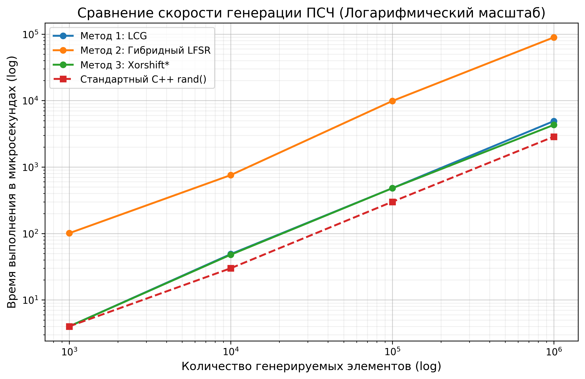

# Programming Methods Lab3

Вариант 23.

## Документация
Cгенерирована с помощью Doxygen:
* [Инструкция по коду (Doxygen)](html/index.html)

## Исходный код
* [GitHub Repository](https://github.com/bloodyEmmy/Programming-Methods-Lab3)

## График результатов
График зависимости времени выполнения алгоритмов генерации псевдослучайных чисел (Линейный конгруэнтный генератор со скремблингом, Гибридный LFSR, Xorshift* и стандартный C++ rand) от размера генерируемой выборки:

